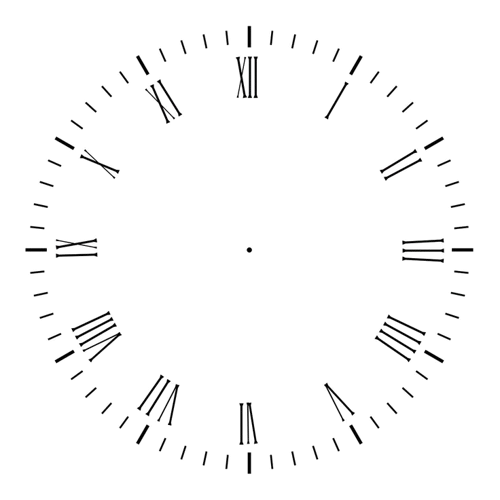

# Project 1 - Clock Game ⏰

This is a simple web-based game built using **HTML, CSS, and JavaScript**. The game features an interactive clock UI and responsive design.

## 🚀 Live Demo

[Click here to play](https://balajimule7.github.io/project1/) (Enable GitHub Pages first)

## 🛠️ Technologies Used

- HTML
- CSS
- JavaScript

## 📁 File Structure

